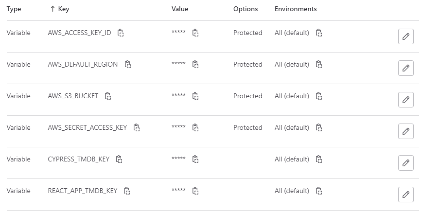
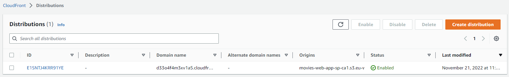
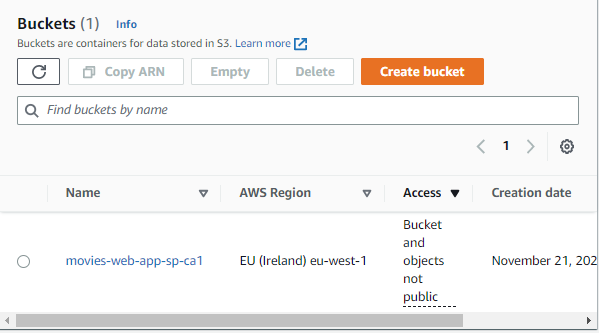

# Assignment 1 - Agile Software Practice.

__Name:__ Rebecca Troy

This repository contains the implementation of a React App and its associated Cypress tests and GitLab CI pipeline.

## React App Features.

This section details the features that have been added to the application as part of Web App Dev
CA1, as well as the pre-existing features that have been modified.
 
+ Trending Movies Page
+ Filter Card for trending movies page with additional option to filter by trending
'this week' or 'today'
+ Cast List for every movie
+ Filter Card for cast list page - search cast by name or character
+ Crew List for every movie
+ Filter Card for crew list page - search crew by name or job
+ Person Details Page (for cast / crew members)
+ Must-Watch feature now fully functional with cache, with 'Must-Watch' movies page similar
to 'Favorites'
+ 'Sort By' filter on all movies, cast, and crew list pages
+ Pagination on all list pages
+ Responsive UI on all pages
+ Session generation and authentication on index page load
+ New MUI Components rating, carousel, autocomplete

## Automated Tests.
+ cypress/e2e/base_movie.cy.js - tests the rendering, display, and navigation of the Movie Details Page, the Review Details
Page / List view, the Cast List Page, the Crew List Page, and the Person Details Page.
+ cypress/e2e/base_movies.cy.js - tests the rendering, display, and navigation of the Discover Movies page, the Favourites
Page, the Upcoming Movies Page, the Must Watch Page, and the Trending Page.
+ cypress/e2e/favorites.cy.js - tests the full functionality of the favorites feature.
+ cypress/e2e/filtering_movies.cy.js - tests the full functionality of filtering through the Discover Movies page, the Favourites
Page, the Upcoming Movies page, the Must Watch page, and the Trending Movies Page.
+ cypress/e2e/filtering_people.cy.js - tests the full functionality of filtering through the Cast List page and the Crew List
page.
+ cypress/e2e/mustwatch.cy.js - tests the full functionality of the favorites feature.
+ cypress/e2e/pagination.cy.js - tests the full functionality of the pagination feature on the Discover Movies page, the Upcoming Movies page, the Trending Movies Pag, the Cast List page, and the Crew List page.
+ cypress/e2e/sorting_movies.cy.js - tests the full functionality of sorting movies on the Discover Movies page, the Favourites
Page, the Upcoming Movies page, the Must Watch page, and the Trending Movies Page.
+ cypress/e2e/sorting_people.cy.js - tests the full functionality of sorting movies on the Cast List page and the Crew List
page.

### Best test cases.

Below lists the pathnames of the two test files I feel best represent my knowledge and understanding of Cypress testing code. I
chose these as they particularly demonstrate Error/Exception handling, nested test case structure, and thorough functionality.

+ cypress/e2e/filtering_movies.cy.js
+ cypress/e2e/mustwatch.cy.js

### Cypress Custom commands.

The following files make use of Cypress custom commands:

+ cypress/e2e/favorites.cy.js
+ cypress/e2e/filtering_movies.cy.js
+ cypress/e2e/mustwatch.cy.js
+ cypress/e2e/sorting.cy.js
+ cypress/e2e/base_movies.cy.js

## Code Splitting.

Below lists the pathnames of each file which contains evidence of code 
splitting in the app. I carried out this everywhere applicable for my app.

+ src/index.js
+ src/components/filterTrendingMoviesCard/index.js
+ src/pages/addMovieReviewPage.js
+ src/pages/castListPage.js
+ src/pages/crewListPage.js
+ src/pages/favoriteMoviesPage.js
+ src/pages/homePage.js
+ src/pages/movieDetailsPage.js
+ src/pages/movieReviewPage.js
+ src/pages/mustWatchMoviesPage.js
+ src/pages/personDetailsPage.js
+ src/pages/trendingMoviesPage.js
+ src/pages/upcomingMoviesPage.js

## Pull Requests.

[The following URL](https://github.com/beckyetroy/AgileSPCA1)
contains the Github repository with my own code that I have merged 2 Pull Requests from.

[The following URL](https://github.com/Bobbins228/agile-soft-assignment-1)
contains the Github repository I have made 2 Pull Requests to.

## Independent learning.

I set up the configuration for auto-deployment of the web app to an AWS S3 bucket. I achieved this with the help of the
[following guide.](https://gist.github.com/johndavedecano/da2939873c105690af6cf0f65ad9fddd) and the configuration can be
seen in the following file:

+ .gitlab-ci.yml

Unfortunately I wasn't able to get this functionality working. But I attach screenshots of the S3 bucket and CloudFront
configured, as well as the AWS variables that were added to the Gitlab project as proof of my effort.

Throughout this assignment, I also learned and utilised many new Cypress commands.
